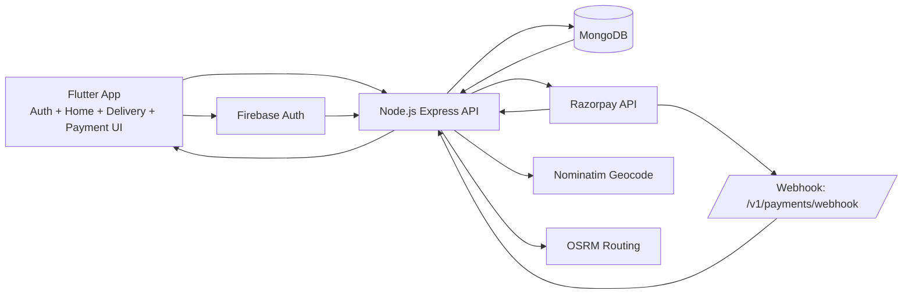

# Dairy Manager - Engineering Snapshot

This file contains the concise technical deliverables you asked for:

1. Module-by-module API table (endpoint, role, input, output)
2. Concise architecture diagram (backend + Flutter data flow)
3. Prioritized fix list with estimated effort

Full semester report-ready content is in `semester8.txt`.

## 1) Module-By-Module API Table

| Module                   | Endpoint(s)                                                                    | Role                              | Input                                                                                  | Output                                                                                     |
| ------------------------ | ------------------------------------------------------------------------------ | --------------------------------- | -------------------------------------------------------------------------------------- | ------------------------------------------------------------------------------------------ | --------------------------------- |
| Auth                     | `POST /v1/auth/sync`                                                           | Any authenticated user            | Firebase ID token in `Authorization` header                                            | User sync result: `userId`, `firebaseUid`, `role`, `profileCompleted`, claim refresh flags |
| User                     | `GET /v1/me`                                                                   | Authenticated                     | Header token                                                                           | Public profile object                                                                      |
| User                     | `PATCH /v1/me/onboarding`                                                      | Authenticated                     | `name`, `mobileNumber`, `role`                                                         | Updated profile with completed onboarding                                                  |
| User                     | `PATCH /v1/me/role`                                                            | Authenticated (policy controlled) | `role`                                                                                 | Updated role + synced claim                                                                |
| User                     | `PATCH /v1/me/profile-update`                                                  | Authenticated seller/customer     | `name`, `mobileNumber`, `displayAddress`, `latitude`, `longitude`, optional `shopName` | Updated user + location payload                                                            |
| Location                 | `POST /v1/me/location/resolve`                                                 | Authenticated                     | `query`                                                                                | Address candidates with lat/lng                                                            |
| Location                 | `PUT /v1/me/location`                                                          | Authenticated seller/customer     | `displayAddress`, `latitude`, `longitude`, optional metadata                           | Saved location summary                                                                     |
| Location                 | `GET /v1/me/location`                                                          | Authenticated                     | Header token                                                                           | Current saved profile location                                                             |
| Discovery                | `GET /v1/sellers/nearby?lat=&lng=&radiusKm=`                                   | Customer                          | Query: `lat`, `lng`, optional `radiusKm`                                               | Nearby sellers with distance, base price, service availability                             |
| Join Request (Customer)  | `POST /v1/customer/join-requests`                                              | Customer                          | `sellerUserId`                                                                         | Created pending join request                                                               |
| Join Request (Customer)  | `GET /v1/customer/join-requests`                                               | Customer                          | Optional filters                                                                       | Request history list                                                                       |
| Join Request (Customer)  | `GET /v1/customer/organization`                                                | Customer                          | Header token                                                                           | Active seller organization details                                                         |
| Join Request (Customer)  | `GET /v1/customer/organization/leave-preview`                                  | Customer                          | Header token                                                                           | Due summary + `canLeave`                                                                   |
| Join Request (Customer)  | `POST /v1/customer/organization/leave`                                         | Customer                          | Header token                                                                           | Leave result + previous organization snapshot                                              |
| Join Request (Seller)    | `GET /v1/seller/join-requests`                                                 | Seller                            | Optional `status`, `sortBy`, `area`, `minQuantityLitres`, `maxDistanceKm`              | Enriched queue list for approval workflow                                                  |
| Join Request (Seller)    | `PATCH /v1/seller/join-requests/:requestId`                                    | Seller                            | `action` (`accept`/`reject`), optional `rejectionReason`                               | Updated request state + notifications                                                      |
| Join Request (Seller)    | `GET /v1/seller/customers`                                                     | Seller                            | Header token                                                                           | Linked organization customers                                                              |
| Notifications            | `GET /v1/notifications`                                                        | Authenticated                     | Optional `unreadOnly`, `limit`                                                         | Notification feed + unread count                                                           |
| Notifications            | `PATCH /v1/notifications/:notificationId/read`                                 | Authenticated                     | Path id                                                                                | Mark one as read                                                                           |
| Notifications            | `PATCH /v1/notifications/read-all`                                             | Authenticated                     | None                                                                                   | Bulk mark as read result                                                                   |
| Delivery Issue           | `POST /v1/customer/delivery-issues`                                            | Customer                          | `issueType`, optional `dateKey`, `description`                                         | Created issue                                                                              |
| Delivery Issue           | `GET /v1/customer/delivery-issues`                                             | Customer                          | Header token                                                                           | Customer issue list                                                                        |
| Delivery Issue           | `GET /v1/seller/delivery-issues`                                               | Seller                            | Optional `status`                                                                      | Seller issue queue                                                                         |
| Delivery Issue           | `PATCH /v1/seller/delivery-issues/:issueId/resolve`                            | Seller                            | Optional `resolutionNote`                                                              | Resolved issue                                                                             |
| Delivery Pause           | `POST /v1/customer/delivery-pauses`                                            | Customer                          | `startDateKey`, `endDateKey`                                                           | Created pause record                                                                       |
| Delivery Pause           | `GET /v1/customer/delivery-pauses`                                             | Customer                          | Header token                                                                           | Customer pause history                                                                     |
| Delivery Pause           | `PATCH /v1/customer/delivery-pauses/:pauseId/resume`                           | Customer                          | Path id                                                                                | Resumed pause                                                                              |
| Delivery Pause           | `GET /v1/seller/delivery-pauses`                                               | Seller                            | Header token                                                                           | Seller active pauses                                                                       |
| Delivery Pause           | `PATCH /v1/seller/delivery-pauses/:pauseId/resume`                             | Seller                            | Path id                                                                                | Resumed pause                                                                              |
| Payment                  | `GET /v1/payments/config`                                                      | Authenticated                     | Header token                                                                           | Razorpay public key id                                                                     |
| Payment                  | `POST /v1/payments/orders`                                                     | Authenticated                     | `amountInRupees`, optional `currency`, `receipt`, `notes`, `source`                    | Razorpay order + local transaction                                                         |
| Payment                  | `POST /v1/payments/verify`                                                     | Authenticated                     | `razorpayOrderId`, `razorpayPaymentId`, `razorpaySignature`                            | Verification result + updated transaction                                                  |
| Payment Webhook          | `POST /v1/payments/webhook`                                                    | Razorpay server-to-server         | Raw JSON body + signature headers                                                      | Idempotent webhook processing result                                                       |
| Seller Delivery Workflow | `GET /api/seller/daily-sheet`                                                  | Seller                            | Header token                                                                           | Today route sheet with distance and pricing                                                |
| Seller Delivery Workflow | `POST /api/seller/deliver-customer`                                            | Seller                            | `customerId`, `quantityLitres`                                                         | Upserted day-slot log                                                                      |
| Seller Delivery Workflow | `POST /api/seller/bulk-deliver`                                                | Seller                            | `customerIds[]`                                                                        | Bulk delivery update summary                                                               |
| Seller Delivery Workflow | `PATCH /api/seller/adjust-log`                                                 | Seller                            | `logId`, `quantityLitres`                                                              | Same-day adjusted log                                                                      |
| Seller Delivery Workflow | `GET /api/seller/monthly-summary`                                              | Seller                            | Optional `month=YYYY-MM`                                                               | Seller month summary with paid/pending splits                                              |
| Seller Delivery Workflow | `GET /api/seller/ledger-logs`                                                  | Seller                            | Optional `month=YYYY-MM`                                                               | Month logs enriched with customer names                                                    |
| Seller Delivery Workflow | `GET /api/seller/settings/milk`                                                | Seller                            | Header token                                                                           | Base price + customer default quantities                                                   |
| Seller Delivery Workflow | `PATCH /api/seller/settings/milk/price`                                        | Seller                            | `basePricePerLitreRupees`                                                              | Updated price setting                                                                      |
| Seller Delivery Workflow | `PATCH /api/seller/settings/milk/customer-default-quantity`                    | Seller                            | `customerUserId`, `defaultQuantityLitres`                                              | Updated customer default quantity                                                          |
| Seller Workflow Quality  | `GET /api/seller/delivery-disputes` + resolve                                  | Seller                            | Optional `status`, resolve payload                                                     | Dispute queue and decisions                                                                |
| Seller Workflow Quality  | `POST /api/seller/correction-requests` + `GET /api/seller/correction-requests` | Seller                            | Log correction payload + optional status                                               | Correction request creation/list                                                           |
| Seller Workflow Quality  | `GET /api/seller/delivery-audit`                                               | Seller                            | Optional `logId`                                                                       | Audit timeline entries                                                                     |
| Customer Ledger Workflow | `GET /api/customer/my-ledger`                                                  | Customer                          | Header token                                                                           | Full ledger logs + summary                                                                 |
| Customer Ledger Workflow | `GET /api/customer/my-ledger/summary`                                          | Customer                          | Optional `month=YYYY-MM`                                                               | Monthly totals (total, paid, pending)                                                      |
| Customer Ledger Workflow | `POST /api/customer/my-ledger/disputes` + list                                 | Customer                          | `logId`, `disputeType`, `message`                                                      | Dispute create/list                                                                        |
| Customer Ledger Workflow | `GET /api/customer/my-ledger/correction-requests`                              | Customer                          | Optional `status`                                                                      | Incoming correction requests                                                               |
| Customer Ledger Workflow | `POST /api/customer/my-ledger/correction-requests/:requestId/approve           | reject`                           | Customer                                                                               | Optional `reviewNote`                                                                      | Decision + optional ledger update |
| Customer Ledger Workflow | `GET /api/customer/my-ledger/audit`                                            | Customer                          | Optional `logId`                                                                       | Customer audit timeline                                                                    |

## 2) Concise Architecture Diagram

## 3) Prioritized Fix List (With Estimated Effort)

| Priority | Item                                                                                    | Why It Matters                                                                                                      | Estimated Effort |
| -------- | --------------------------------------------------------------------------------------- | ------------------------------------------------------------------------------------------------------------------- | ---------------- |
| P0       | Fix due-summary field mismatch in organization leave preview logic                      | Current query can undercount dues due to field mismatch in cross-module query, allowing incorrect leave eligibility | 2-4 hours        |
| P1       | Split large `home_feature_page.dart` into feature-specific screens/widgets              | Current monolithic UI file is hard to maintain, test, and debug                                                     | 3-5 days         |
| P1       | Add integration tests for critical backend flows (join, billing, payment verify, leave) | Prevent regressions in core business workflows                                                                      | 2-3 days         |
| P1       | Add Flutter tests for role-based navigation and payment/error flows                     | Improve release confidence and detect UI/state regressions early                                                    | 2-4 days         |
| P2       | Consolidate duplicate auth state paths (`AuthCubit` active vs legacy `AuthBloc`)        | Reduces confusion and technical debt                                                                                | 1-2 days         |
| P2       | Centralize API base URL resolution across repositories/services                         | Avoid repeated networking config and inconsistent behavior across modules                                           | 4-8 hours        |
| P2       | Produce API contract doc (OpenAPI or equivalent) for frontend-backend sync              | Speeds onboarding and minimizes integration misunderstandings                                                       | 1-2 days         |
| P3       | Add role-based access audit logging around sensitive actions                            | Better observability and safer operations                                                                           | 1-2 days         |

## Notes

- Planning file has been separated and cleared as requested: `semester8_report_plan.txt`.
- Full semester report content with diagrams and flowcharts is provided separately in `semester8.txt`.
